# Use Case Giao Diện Cho Investor Và Owner

## Tổng quan

- Tổng số use case giao diện: 25
- Investor-only: 4
- Owner-only: 6
- Dùng chung Investor và Owner: 15
- Phạm vi: chỉ các thao tác thực tế trên frontend (client/app, client/components).

## Danh mục use case

| ID     | Tên use case                               | Tác nhân                         |
| ------ | ------------------------------------------ | -------------------------------- |
| UI-001 | Đăng ký tài khoản                          | Investor, Owner (người dùng mới) |
| UI-002 | Đăng nhập hệ thống                         | Investor, Owner                  |
| UI-003 | Xem hồ sơ cá nhân và thông tin tài khoản   | Investor, Owner                  |
| UI-004 | Cập nhật hồ sơ và ảnh đại diện             | Investor, Owner                  |
| UI-005 | Đổi mật khẩu tài khoản                     | Investor, Owner                  |
| UI-006 | Cài đặt thông báo và sở thích danh mục     | Investor, Owner                  |
| UI-007 | Nộp KYC và theo dõi trạng thái xác minh    | Investor, Owner                  |
| UI-008 | Nạp tiền vào ví (VNPAY/MoMo)               | Investor, Owner                  |
| UI-009 | Rút tiền khỏi ví                           | Investor, Owner                  |
| UI-010 | Xem lịch sử giao dịch cá nhân              | Investor, Owner                  |
| UI-011 | Quản lý thông báo trong ứng dụng           | Investor, Owner                  |
| UI-012 | Sử dụng AI Chatbox hỗ trợ phân tích        | Investor, Owner                  |
| UI-013 | Quản lý thư viện media trên giao diện      | Investor, Owner                  |
| UI-014 | Tìm kiếm và xem danh sách dự án            | Investor, Owner                  |
| UI-015 | Xem chi tiết dự án và hồ sơ công khai      | Investor, Owner                  |
| UI-016 | Đầu tư vào dự án                           | Investor                         |
| UI-017 | Theo dõi danh mục đầu tư và chỉ số cá nhân | Investor                         |
| UI-018 | Tạo khiếu nại dự án                        | Investor                         |
| UI-019 | Tham gia voting milestone và xem thảo luận | Investor                         |
| UI-020 | Tạo dự án mới                              | Owner                            |
| UI-021 | Cập nhật thông tin dự án                   | Owner                            |
| UI-022 | Quản lý milestones của dự án               | Owner                            |
| UI-023 | Dừng huy động vốn sớm                      | Owner                            |
| UI-024 | Theo dõi danh sách dự án của tôi           | Owner                            |
| UI-025 | Thanh toán nợ dự án (repay)                | Owner                            |

## Chi tiết use case (mẫu giao diện)

### 2.2.1. Use case Đăng ký tài khoản

Mục đích: Cho phép người dùng tạo tài khoản để bắt đầu sử dụng nền tảng với vai trò Investor hoặc Owner.

Tác nhân, mô tả chung:

- Tác nhân: Investor, Owner (người dùng mới).
- Mô tả chung: Người dùng điền thông tin ở màn hình đăng ký, hệ thống tạo tài khoản nếu dữ liệu hợp lệ.

Luồng sự kiện chính
Bảng 1. Luồng sự kiện chính use case Đăng ký tài khoản

| Hành động của tác nhân                               | Phản ứng của hệ thống                         |
| ---------------------------------------------------- | --------------------------------------------- |
| 1. Người dùng mở màn hình Đăng ký và nhập thông tin. | 2. Hệ thống kiểm tra tính hợp lệ của dữ liệu. |
| -                                                    | 3. Hệ thống gọi API tạo tài khoản mới.        |
| -                                                    | 4. Giao diện thông báo đăng ký thành công.    |

Luồng thay thế:

- 1. Email đã tồn tại hoặc dữ liệu không hợp lệ -> hệ thống trả lỗi và yêu cầu nhập lại.

Các yêu cầu cụ thể:

- API: POST /api/auth/register
- Frontend: client/app/(main)/(auth)/register/page.tsx

Điều kiện trước:

- Người dùng chưa có tài khoản.

Điều kiện sau:

- Tài khoản mới được tạo thành công.

---

### 2.2.2. Use case Đăng nhập hệ thống

Mục đích: Xác thực người dùng để truy cập dashboard theo vai trò.

Tác nhân, mô tả chung:

- Tác nhân: Investor, Owner.
- Mô tả chung: Người dùng nhập thông tin đăng nhập, hệ thống cấp phiên truy cập hợp lệ.

Luồng sự kiện chính
Bảng 2. Luồng sự kiện chính use case Đăng nhập hệ thống

| Hành động của tác nhân                | Phản ứng của hệ thống                        |
| ------------------------------------- | -------------------------------------------- |
| 1. Người dùng nhập email và mật khẩu. | 2. Hệ thống xác thực thông tin đăng nhập.    |
| -                                     | 3. Hệ thống trả token và hồ sơ người dùng.   |
| -                                     | 4. Giao diện chuyển đến dashboard tương ứng. |

Luồng thay thế:

- 1. Sai tài khoản hoặc mật khẩu -> hiển thị thông báo lỗi đăng nhập.

Các yêu cầu cụ thể:

- API: POST /api/auth/login, GET /api/auth/profile
- Frontend: client/app/(main)/(auth)/login/page.tsx

Điều kiện trước:

- Tài khoản đã được tạo và chưa bị khóa.

Điều kiện sau:

- Người dùng đăng nhập thành công, có token hợp lệ.

---

### 2.2.3. Use case Xem hồ sơ cá nhân và thông tin tài khoản

Mục đích: Giúp người dùng theo dõi thông tin tài khoản, vai trò và số dư hiện tại.

Tác nhân, mô tả chung:

- Tác nhân: Investor, Owner.
- Mô tả chung: Người dùng mở dashboard hoặc trang profile để xem thông tin cá nhân.

Luồng sự kiện chính
Bảng 3. Luồng sự kiện chính use case Xem hồ sơ cá nhân và thông tin tài khoản

| Hành động của tác nhân                    | Phản ứng của hệ thống                               |
| ----------------------------------------- | --------------------------------------------------- |
| 1. Người dùng truy cập dashboard/profile. | 2. Hệ thống lấy dữ liệu hồ sơ từ backend.           |
| -                                         | 3. Hệ thống hiển thị thông tin cá nhân và số dư ví. |
| -                                         | 4. Người dùng theo dõi thông tin hiện tại.          |

Luồng thay thế:

- 1. Phiên đăng nhập hết hạn -> yêu cầu người dùng đăng nhập lại.

Các yêu cầu cụ thể:

- API: GET /api/auth/profile, GET /api/users/profile
- Frontend: DashboardLayout, ProfileView, Navbar

Điều kiện trước:

- Người dùng đã đăng nhập.

Điều kiện sau:

- Thông tin cá nhân được hiển thị đầy đủ trên giao diện.

---

### 2.2.4. Use case Cập nhật hồ sơ và ảnh đại diện

Mục đích: Cho phép người dùng chỉnh sửa thông tin cá nhân và ảnh đại diện.

Tác nhân, mô tả chung:

- Tác nhân: Investor, Owner.
- Mô tả chung: Người dùng cập nhật dữ liệu trong màn hình cài đặt tài khoản.

Luồng sự kiện chính
Bảng 4. Luồng sự kiện chính use case Cập nhật hồ sơ và ảnh đại diện

| Hành động của tác nhân             | Phản ứng của hệ thống                                |
| ---------------------------------- | ---------------------------------------------------- |
| 1. Người dùng mở màn hình Cài đặt. | 2. Người dùng chỉnh sửa thông tin hoặc chọn ảnh mới. |
| -                                  | 3. Hệ thống gửi yêu cầu cập nhật đến backend.        |
| -                                  | 4. Giao diện hiển thị dữ liệu đã cập nhật.           |

Luồng thay thế:

- 1. Ảnh không hợp lệ hoặc dữ liệu sai định dạng -> thông báo lỗi.

Các yêu cầu cụ thể:

- API: PATCH /api/users/profile, PATCH /api/users/avatar
- Frontend: client/components/dashboard/views/SettingsView.tsx

Điều kiện trước:

- Người dùng đã đăng nhập.

Điều kiện sau:

- Hồ sơ người dùng được cập nhật thành công.

---

### 2.2.5. Use case Đổi mật khẩu tài khoản

Mục đích: Nâng cao bảo mật tài khoản bằng cách thay đổi mật khẩu.

Tác nhân, mô tả chung:

- Tác nhân: Investor, Owner.
- Mô tả chung: Người dùng cung cấp mật khẩu cũ và mật khẩu mới trong trang cài đặt.

Luồng sự kiện chính
Bảng 5. Luồng sự kiện chính use case Đổi mật khẩu tài khoản

| Hành động của tác nhân                     | Phản ứng của hệ thống                                 |
| ------------------------------------------ | ----------------------------------------------------- |
| 1. Người dùng chọn chức năng Đổi mật khẩu. | 2. Người dùng nhập mật khẩu cũ và mật khẩu mới.       |
| -                                          | 3. Hệ thống xác thực mật khẩu cũ và lưu mật khẩu mới. |
| -                                          | 4. Giao diện thông báo cập nhật thành công.           |

Luồng thay thế:

- 1. Mật khẩu cũ không đúng hoặc mật khẩu mới không đạt yêu cầu -> thông báo lỗi.

Các yêu cầu cụ thể:

- API: PATCH /api/users/change-password
- Frontend: client/components/dashboard/views/SettingsView.tsx

Điều kiện trước:

- Người dùng đã đăng nhập.

Điều kiện sau:

- Mật khẩu mới có hiệu lực.

---

### 2.2.6. Use case Cài đặt thông báo và sở thích danh mục

Mục đích: Cá nhân hóa trải nghiệm nhận thông báo và danh mục quan tâm.

Tác nhân, mô tả chung:

- Tác nhân: Investor, Owner.
- Mô tả chung: Người dùng bật/tắt thông báo và cập nhật danh mục quan tâm trong cài đặt.

Luồng sự kiện chính
Bảng 6. Luồng sự kiện chính use case Cài đặt thông báo và sở thích danh mục

| Hành động của tác nhân                    | Phản ứng của hệ thống                        |
| ----------------------------------------- | -------------------------------------------- |
| 1. Người dùng mở phần Thông báo/Sở thích. | 2. Người dùng thay đổi các tùy chọn cá nhân. |
| -                                         | 3. Hệ thống cập nhật cấu hình lên backend.   |
| -                                         | 4. Giao diện đồng bộ trạng thái mới.         |

Luồng thay thế:

- 1. Dữ liệu tùy chọn không hợp lệ -> hệ thống từ chối và báo lỗi.

Các yêu cầu cụ thể:

- API: PATCH /api/users/notification-settings, PATCH /api/users/preferences/category/:categoryId/toggle
- Frontend: client/components/dashboard/views/SettingsView.tsx

Điều kiện trước:

- Người dùng đã đăng nhập.

Điều kiện sau:

- Cấu hình cá nhân được lưu thành công.

---

### 2.2.7. Use case Nộp KYC và theo dõi trạng thái xác minh

Mục đích: Xác minh danh tính để mở khóa các tính năng tài chính.

Tác nhân, mô tả chung:

- Tác nhân: Investor, Owner.
- Mô tả chung: Người dùng tải giấy tờ KYC và theo dõi trạng thái xử lý hồ sơ.

Luồng sự kiện chính
Bảng 7. Luồng sự kiện chính use case Nộp KYC và theo dõi trạng thái xác minh

| Hành động của tác nhân         | Phản ứng của hệ thống                                        |
| ------------------------------ | ------------------------------------------------------------ |
| 1. Người dùng mở màn hình KYC. | 2. Người dùng tải ảnh giấy tờ và nhập dữ liệu xác minh.      |
| -                              | 3. Hệ thống ghi nhận hồ sơ KYC.                              |
| -                              | 4. Giao diện hiển thị trạng thái chờ duyệt/đã duyệt/từ chối. |

Luồng thay thế:

- 1. Thiếu ảnh hoặc dữ liệu sai định dạng -> hệ thống từ chối nộp hồ sơ.

Các yêu cầu cụ thể:

- API: GET /api/users/kyc/status, POST /api/users/kyc/upload, POST /api/users/kyc
- Frontend: client/components/dashboard/views/KycView.tsx

Điều kiện trước:

- Người dùng đã đăng nhập.

Điều kiện sau:

- Hồ sơ KYC được ghi nhận và có trạng thái xử lý.

---

### 2.2.8. Use case Nạp tiền vào ví (VNPAY/MoMo)

Mục đích: Nạp số dư vào ví để phục vụ đầu tư và thanh toán.

Tác nhân, mô tả chung:

- Tác nhân: Investor, Owner.
- Mô tả chung: Người dùng tạo giao dịch nạp tiền và thanh toán qua cổng VNPAY hoặc MoMo.

Luồng sự kiện chính
Bảng 8. Luồng sự kiện chính use case Nạp tiền vào ví (VNPAY/MoMo)

| Hành động của tác nhân              | Phản ứng của hệ thống                               |
| ----------------------------------- | --------------------------------------------------- |
| 1. Người dùng nhập số tiền cần nạp. | 2. Hệ thống tạo yêu cầu nạp tiền vào ví.            |
| -                                   | 3. Hệ thống tạo URL thanh toán theo cổng được chọn. |
| -                                   | 4. Giao diện chuyển hướng sang cổng thanh toán.     |

Luồng thay thế:

- 1. Số tiền không hợp lệ hoặc cổng thanh toán lỗi -> không tạo được URL thanh toán.

Các yêu cầu cụ thể:

- API: POST /api/wallets/deposit, POST /api/payment/create-url, POST /api/payment/create-momo-url
- Frontend: FintechModals, client/app/(main)/dashboard/deposit/page.tsx

Điều kiện trước:

- Người dùng đã đăng nhập.

Điều kiện sau:

- Giao dịch nạp tiền được tạo và chờ callback xác nhận.

---

### 2.2.9. Use case Rút tiền khỏi ví

Mục đích: Cho phép người dùng rút số dư ví về tài khoản ngân hàng.

Tác nhân, mô tả chung:

- Tác nhân: Investor, Owner.
- Mô tả chung: Người dùng gửi yêu cầu rút tiền từ dashboard tài chính.

Luồng sự kiện chính
Bảng 9. Luồng sự kiện chính use case Rút tiền khỏi ví

| Hành động của tác nhân               | Phản ứng của hệ thống                               |
| ------------------------------------ | --------------------------------------------------- |
| 1. Người dùng mở chức năng Rút tiền. | 2. Người dùng nhập số tiền và thông tin ngân hàng.  |
| -                                    | 3. Hệ thống kiểm tra số dư và điều kiện rút.        |
| -                                    | 4. Hệ thống tạo giao dịch rút ở trạng thái pending. |

Luồng thay thế:

- 1. Số dư không đủ hoặc tài khoản bị ràng buộc -> từ chối rút tiền.

Các yêu cầu cụ thể:

- API: POST /api/wallets/withdraw
- Frontend: client/components/dashboard/modals/FintechModals.tsx

Điều kiện trước:

- Người dùng đã đăng nhập, có số dư khả dụng.

Điều kiện sau:

- Yêu cầu rút tiền được tạo thành công.

---

### 2.2.10. Use case Xem lịch sử giao dịch cá nhân

Mục đích: Giúp người dùng theo dõi biến động ví và các giao dịch đã thực hiện.

Tác nhân, mô tả chung:

- Tác nhân: Investor, Owner.
- Mô tả chung: Người dùng xem danh sách giao dịch trong dashboard.

Luồng sự kiện chính
Bảng 10. Luồng sự kiện chính use case Xem lịch sử giao dịch cá nhân

| Hành động của tác nhân                  | Phản ứng của hệ thống                           |
| --------------------------------------- | ----------------------------------------------- |
| 1. Người dùng mở mục lịch sử giao dịch. | 2. Hệ thống tải dữ liệu giao dịch từ backend.   |
| -                                       | 3. Hệ thống hiển thị danh sách theo thời gian.  |
| -                                       | 4. Người dùng lọc và tra cứu giao dịch cần xem. |

Luồng thay thế:

- 1. Không tải được dữ liệu -> hiển thị trạng thái lỗi hoặc rỗng.

Các yêu cầu cụ thể:

- API: GET /api/wallets/history, GET /api/transactions
- Frontend: Overview, WalletView

Điều kiện trước:

- Người dùng đã đăng nhập.

Điều kiện sau:

- Người dùng quan sát được lịch sử biến động tài chính.

---

### 2.2.11. Use case Quản lý thông báo trong ứng dụng

Mục đích: Giúp người dùng theo dõi sự kiện quan trọng và quản lý trạng thái đã đọc.

Tác nhân, mô tả chung:

- Tác nhân: Investor, Owner.
- Mô tả chung: Người dùng xem danh sách thông báo và đánh dấu đã đọc.

Luồng sự kiện chính
Bảng 11. Luồng sự kiện chính use case Quản lý thông báo trong ứng dụng

| Hành động của tác nhân                | Phản ứng của hệ thống                                |
| ------------------------------------- | ---------------------------------------------------- |
| 1. Người dùng mở trung tâm thông báo. | 2. Hệ thống tải danh sách thông báo.                 |
| -                                     | 3. Người dùng đánh dấu từng thông báo hoặc toàn bộ.  |
| -                                     | 4. Hệ thống cập nhật trạng thái đã đọc trên backend. |

Luồng thay thế:

- 1. Thông báo không tồn tại hoặc lỗi cập nhật -> thông báo thất bại.

Các yêu cầu cụ thể:

- API: GET /api/notifications, PATCH /api/notifications/:id/read, PATCH /api/notifications/read-all
- Frontend: NotificationProvider

Điều kiện trước:

- Người dùng đã đăng nhập.

Điều kiện sau:

- Trạng thái đọc/chưa đọc được đồng bộ.

---

### 2.2.12. Use case Sử dụng AI Chatbox hỗ trợ phân tích

Mục đích: Hỗ trợ người dùng đặt câu hỏi nhanh về dự án, rủi ro và dòng tiền.

Tác nhân, mô tả chung:

- Tác nhân: Investor, Owner.
- Mô tả chung: Người dùng nhắn tin trong AI Chatbox để nhận phản hồi và lưu lịch sử hội thoại.

Luồng sự kiện chính
Bảng 12. Luồng sự kiện chính use case Sử dụng AI Chatbox hỗ trợ phân tích

| Hành động của tác nhân       | Phản ứng của hệ thống                                |
| ---------------------------- | ---------------------------------------------------- |
| 1. Người dùng mở AI Chatbox. | 2. Hệ thống tải lịch sử chat trước đó.               |
| -                            | 3. Người dùng gửi câu hỏi mới.                       |
| -                            | 4. Hệ thống trả lời và cập nhật giao diện hội thoại. |

Luồng thay thế:

- 1. Chưa đăng nhập hoặc AI service lỗi -> hiển thị thông điệp fallback.

Các yêu cầu cụ thể:

- API: GET /api/ai-chat/history, POST /api/ai-chat/message, DELETE /api/ai-chat/history
- Frontend: client/components/client/AIChatbox.tsx

Điều kiện trước:

- Người dùng đã đăng nhập.

Điều kiện sau:

- Phiên hội thoại được cập nhật thêm tin nhắn mới.

---

### 2.2.13. Use case Quản lý thư viện media trên giao diện

Mục đích: Quản lý tài nguyên ảnh/video dùng cho nội dung dự án.

Tác nhân, mô tả chung:

- Tác nhân: Investor, Owner.
- Mô tả chung: Người dùng mở media modal để tải lên, chọn hoặc xóa tài nguyên.

Luồng sự kiện chính
Bảng 13. Luồng sự kiện chính use case Quản lý thư viện media trên giao diện

| Hành động của tác nhân                | Phản ứng của hệ thống                     |
| ------------------------------------- | ----------------------------------------- |
| 1. Người dùng mở Media Library Modal. | 2. Hệ thống tải danh sách media hiện có.  |
| -                                     | 3. Người dùng tải lên hoặc xóa media.     |
| -                                     | 4. Hệ thống cập nhật danh sách media mới. |

Luồng thay thế:

- 1. Upload thất bại hoặc file không hợp lệ -> thông báo lỗi.

Các yêu cầu cụ thể:

- API: GET /api/media, POST /api/media/upload, DELETE /api/media/:id
- Frontend: client/components/client/MediaLibraryModal.tsx

Điều kiện trước:

- Người dùng đã đăng nhập.

Điều kiện sau:

- Dữ liệu media được đồng bộ theo thao tác mới nhất.

---

### 2.2.14. Use case Tìm kiếm và xem danh sách dự án

Mục đích: Giúp người dùng tìm nhanh dự án theo từ khóa và bộ lọc.

Tác nhân, mô tả chung:

- Tác nhân: Investor, Owner.
- Mô tả chung: Người dùng tìm dự án ở thanh tìm kiếm hoặc trang danh sách dự án.

Luồng sự kiện chính
Bảng 14. Luồng sự kiện chính use case Tìm kiếm và xem danh sách dự án

| Hành động của tác nhân               | Phản ứng của hệ thống                         |
| ------------------------------------ | --------------------------------------------- |
| 1. Người dùng nhập từ khóa tìm kiếm. | 2. Hệ thống tải gợi ý và kết quả theo bộ lọc. |
| -                                    | 3. Người dùng chọn dự án quan tâm.            |
| -                                    | 4. Giao diện chuyển tới trang chi tiết dự án. |

Luồng thay thế:

- 1. Không có kết quả -> hiển thị trạng thái rỗng kèm gợi ý.

Các yêu cầu cụ thể:

- API: GET /api/projects, GET /api/projects/suggestions, GET /api/project-categories
- Frontend: HeaderSearch, client/app/(main)/projects/page.tsx

Điều kiện trước:

- Không bắt buộc đăng nhập để xem danh sách dự án.

Điều kiện sau:

- Người dùng xác định được dự án cần phân tích.

---

### 2.2.15. Use case Xem chi tiết dự án và hồ sơ công khai

Mục đích: Cung cấp thông tin tham chiếu trước khi đầu tư hoặc hợp tác.

Tác nhân, mô tả chung:

- Tác nhân: Investor, Owner.
- Mô tả chung: Người dùng xem trang chi tiết dự án và hồ sơ công khai của chủ thể liên quan.

Luồng sự kiện chính
Bảng 15. Luồng sự kiện chính use case Xem chi tiết dự án và hồ sơ công khai

| Hành động của tác nhân                 | Phản ứng của hệ thống                                     |
| -------------------------------------- | --------------------------------------------------------- |
| 1. Người dùng mở trang chi tiết dự án. | 2. Hệ thống tải thông tin dự án, milestones và chủ dự án. |
| -                                      | 3. Người dùng mở hồ sơ công khai của owner/investor.      |
| -                                      | 4. Hệ thống hiển thị danh sách dự án đã tạo/đã đầu tư.    |

Luồng thay thế:

- 1. Không tìm thấy dự án hoặc hồ sơ công khai -> hiển thị trạng thái không tồn tại.

Các yêu cầu cụ thể:

- API: GET /api/projects/:identifier, GET /api/users/:identifier/public, GET /api/users/slug/:slug/public, GET /api/projects/user/:userIdentifier/created, GET /api/projects/user/:userIdentifier/invested
- Frontend: project detail page, public profile page

Điều kiện trước:

- Người dùng truy cập bằng slug/id hợp lệ.

Điều kiện sau:

- Bộ dữ liệu tham chiếu được hiển thị đầy đủ.

---

### 2.2.16. Use case Đầu tư vào dự án

Mục đích: Cho phép Investor góp vốn vào dự án đang mở huy động.

Tác nhân, mô tả chung:

- Tác nhân: Investor.
- Mô tả chung: Investor nhập số tiền đầu tư từ trang chi tiết dự án.

Luồng sự kiện chính
Bảng 16. Luồng sự kiện chính use case Đầu tư vào dự án

| Hành động của tác nhân                         | Phản ứng của hệ thống                                         |
| ---------------------------------------------- | ------------------------------------------------------------- |
| 1. Investor chọn dự án và nhập số tiền đầu tư. | 2. Hệ thống kiểm tra quyền, mức đầu tư tối thiểu và số dư ví. |
| -                                              | 3. Hệ thống tạo bản ghi đầu tư và trừ số dư ví.               |
| -                                              | 4. Giao diện cập nhật tiến độ huy động của dự án.             |

Luồng thay thế:

- 1. Không đủ số dư hoặc dự án không còn trạng thái funding -> từ chối đầu tư.

Các yêu cầu cụ thể:

- API: POST /api/investments
- Frontend: client/app/(main)/projects/[slug]/page.tsx

Điều kiện trước:

- Người dùng có vai trò Investor, đã đăng nhập.

Điều kiện sau:

- Khoản đầu tư mới được ghi nhận thành công.

---

### 2.2.17. Use case Theo dõi danh mục đầu tư và chỉ số cá nhân

Mục đích: Giúp Investor theo dõi hiệu quả danh mục theo thời gian.

Tác nhân, mô tả chung:

- Tác nhân: Investor.
- Mô tả chung: Investor xem My Portfolio, Overview và Analytics để theo dõi hiệu suất đầu tư.

Luồng sự kiện chính
Bảng 17. Luồng sự kiện chính use case Theo dõi danh mục đầu tư và chỉ số cá nhân

| Hành động của tác nhân                                   | Phản ứng của hệ thống                               |
| -------------------------------------------------------- | --------------------------------------------------- |
| 1. Investor mở các màn hình danh mục/overview/analytics. | 2. Hệ thống tải dữ liệu đầu tư và số liệu tổng hợp. |
| -                                                        | 3. Hệ thống hiển thị biểu đồ và chỉ số hiệu suất.   |
| -                                                        | 4. Investor dựa vào dữ liệu để đánh giá danh mục.   |

Luồng thay thế:

- 1. Chưa có khoản đầu tư -> hiển thị trạng thái rỗng.

Các yêu cầu cụ thể:

- API: GET /api/investments/my-investments, GET /api/investments/analytics, GET /api/projects/user/:userIdentifier/invested
- Frontend: MyPortfolio, Overview, AnalyticsView

Điều kiện trước:

- Investor đã đăng nhập.

Điều kiện sau:

- Investor nắm được tình trạng danh mục hiện tại.

---

### 2.2.18. Use case Tạo khiếu nại dự án

Mục đích: Cho phép Investor phản ánh vấn đề dự án để khởi tạo quy trình xử lý tranh chấp.

Tác nhân, mô tả chung:

- Tác nhân: Investor.
- Mô tả chung: Investor gửi nội dung khiếu nại liên quan đến dự án đã tham gia.

Luồng sự kiện chính
Bảng 18. Luồng sự kiện chính use case Tạo khiếu nại dự án

| Hành động của tác nhân                    | Phản ứng của hệ thống                                |
| ----------------------------------------- | ---------------------------------------------------- |
| 1. Investor mở tính năng Khiếu nại dự án. | 2. Investor nhập lý do khiếu nại và xác nhận gửi.    |
| -                                         | 3. Hệ thống tạo bản ghi dispute.                     |
| -                                         | 4. Hệ thống cập nhật danh sách tranh chấp liên quan. |

Luồng thay thế:

- 1. Người gửi không đủ điều kiện hoặc dữ liệu không hợp lệ -> từ chối tạo khiếu nại.

Các yêu cầu cụ thể:

- API: POST /api/projects/:id/disputes
- Frontend: client/components/dashboard/views/MyPortfolio.tsx

Điều kiện trước:

- Investor đã đăng nhập và có liên quan đến dự án.

Điều kiện sau:

- Khiếu nại được tạo ở trạng thái mở.

---

### 2.2.19. Use case Tham gia voting milestone và xem thảo luận

Mục đích: Cho phép Investor bỏ phiếu ở milestone đang mở voting.

Tác nhân, mô tả chung:

- Tác nhân: Investor.
- Mô tả chung: Investor xem thảo luận milestone và gửi phiếu biểu quyết từ giao diện dự án.

Luồng sự kiện chính
Bảng 19. Luồng sự kiện chính use case Tham gia voting milestone và xem thảo luận

| Hành động của tác nhân                              | Phản ứng của hệ thống                                      |
| --------------------------------------------------- | ---------------------------------------------------------- |
| 1. Investor mở khu vực milestone trong trang dự án. | 2. Hệ thống tải nội dung thảo luận của milestone.          |
| -                                                   | 3. Investor gửi phiếu vote và bình luận (nếu có).          |
| -                                                   | 4. Hệ thống ghi nhận vote và cập nhật trạng thái hiển thị. |

Luồng thay thế:

- 1. Hết hạn vote hoặc người dùng không có quyền vote -> từ chối thao tác.

Các yêu cầu cụ thể:

- API: GET /api/projects/milestones/:mId/discussions, POST /api/projects/milestones/:mId/vote
- Frontend: client/components/client/ProjectMilestones.tsx

Điều kiện trước:

- Investor đã đăng nhập, milestone ở trạng thái voting hợp lệ.

Điều kiện sau:

- Phiếu bầu của investor được lưu thành công.

---

### 2.2.20. Use case Tạo dự án mới

Mục đích: Cho phép Owner tạo dự án mới để kêu gọi vốn.

Tác nhân, mô tả chung:

- Tác nhân: Owner.
- Mô tả chung: Owner nhập thông tin dự án và gửi form tạo dự án.

Luồng sự kiện chính
Bảng 20. Luồng sự kiện chính use case Tạo dự án mới

| Hành động của tác nhân          | Phản ứng của hệ thống                                        |
| ------------------------------- | ------------------------------------------------------------ |
| 1. Owner mở màn hình Tạo dự án. | 2. Owner nhập thông tin dự án, chọn danh mục, upload media.  |
| -                               | 3. Hệ thống kiểm tra điều kiện dữ liệu và KYC.               |
| -                               | 4. Hệ thống tạo dự án và hiển thị trong danh sách của owner. |

Luồng thay thế:

- 1. Chưa KYC hoặc thiếu dữ liệu bắt buộc -> từ chối tạo dự án.

Các yêu cầu cụ thể:

- API: POST /api/projects, GET /api/project-categories
- Frontend: client/app/(main)/projects/create/page.tsx, MyProjects

Điều kiện trước:

- Owner đã đăng nhập, đáp ứng điều kiện KYC.

Điều kiện sau:

- Dự án mới được tạo thành công.

---

### 2.2.21. Use case Cập nhật thông tin dự án

Mục đích: Cho phép Owner chỉnh sửa nội dung dự án khi dự án còn ở trạng thái cho phép.

Tác nhân, mô tả chung:

- Tác nhân: Owner.
- Mô tả chung: Owner mở trang chỉnh sửa và cập nhật thông tin dự án.

Luồng sự kiện chính
Bảng 21. Luồng sự kiện chính use case Cập nhật thông tin dự án

| Hành động của tác nhân        | Phản ứng của hệ thống                               |
| ----------------------------- | --------------------------------------------------- |
| 1. Owner mở trang Edit dự án. | 2. Owner chỉnh sửa mô tả, media, danh mục, tham số. |
| -                             | 3. Hệ thống gửi yêu cầu cập nhật lên backend.       |
| -                             | 4. Hệ thống lưu thay đổi và trả dữ liệu mới.        |

Luồng thay thế:

- 1. Owner không có quyền hoặc dự án không cho phép sửa -> từ chối cập nhật.

Các yêu cầu cụ thể:

- API: PUT /api/projects/:id
- Frontend: client/app/(main)/dashboard/my-projects/[id]/edit/page.tsx

Điều kiện trước:

- Owner đã đăng nhập và là chủ dự án.

Điều kiện sau:

- Dữ liệu dự án được cập nhật thành công.

---

### 2.2.22. Use case Quản lý milestones của dự án

Mục đích: Cho phép Owner quản lý tiến độ milestone và thao tác vận hành liên quan.

Tác nhân, mô tả chung:

- Tác nhân: Owner.
- Mô tả chung: Owner cập nhật milestones, upload bằng chứng, bắt đầu voting và phản hồi thảo luận.

Luồng sự kiện chính
Bảng 22. Luồng sự kiện chính use case Quản lý milestones của dự án

| Hành động của tác nhân                         | Phản ứng của hệ thống                              |
| ---------------------------------------------- | -------------------------------------------------- |
| 1. Owner mở trang quản lý milestone của dự án. | 2. Owner cập nhật danh sách milestone khi cần.     |
| -                                              | 3. Owner tải bằng chứng cho milestone đến hạn.     |
| -                                              | 4. Owner bắt đầu voting và gửi phản hồi thảo luận. |

Luồng thay thế:

- 1. Milestone sai trạng thái hoặc owner không đủ quyền -> từ chối thao tác.

Các yêu cầu cụ thể:

- API: PUT /api/projects/:id/milestones, PATCH /api/projects/:id/milestones/:mId/proof, POST /api/projects/milestones/:mId/start-voting, POST /api/projects/milestones/:mId/response, GET /api/projects/milestones/:mId/discussions
- Frontend: my-projects/[id]/page.tsx, ProjectMilestones.tsx, MyProjects.tsx

Điều kiện trước:

- Owner đã đăng nhập và là chủ dự án.

Điều kiện sau:

- Tiến độ milestone được cập nhật theo thao tác mới nhất.

---

### 2.2.23. Use case Dừng huy động vốn sớm

Mục đích: Cho phép Owner kết thúc sớm đợt huy động của dự án.

Tác nhân, mô tả chung:

- Tác nhân: Owner.
- Mô tả chung: Owner chọn thao tác dừng huy động từ danh sách dự án của mình.

Luồng sự kiện chính
Bảng 23. Luồng sự kiện chính use case Dừng huy động vốn sớm

| Hành động của tác nhân                            | Phản ứng của hệ thống                                              |
| ------------------------------------------------- | ------------------------------------------------------------------ |
| 1. Owner chọn dự án đang funding trong dashboard. | 2. Owner xác nhận thao tác dừng huy động.                          |
| -                                                 | 3. Hệ thống cập nhật trạng thái dự án và kích hoạt bước tiếp theo. |
| -                                                 | 4. Giao diện hiển thị trạng thái mới của dự án.                    |

Luồng thay thế:

- 1. Dự án không còn ở trạng thái funding hoặc không thuộc owner -> từ chối thao tác.

Các yêu cầu cụ thể:

- API: PUT /api/projects/:id/stop-funding
- Frontend: MyProjects.tsx, my-projects/[id]/edit/page.tsx

Điều kiện trước:

- Owner đã đăng nhập và là chủ dự án.

Điều kiện sau:

- Dự án dừng huy động thành công.

---

### 2.2.24. Use case Theo dõi danh sách dự án của tôi

Mục đích: Giúp Owner theo dõi tổng quan tiến độ và trạng thái tất cả dự án của mình.

Tác nhân, mô tả chung:

- Tác nhân: Owner.
- Mô tả chung: Owner mở màn hình My Projects để xem danh sách dự án đang sở hữu.

Luồng sự kiện chính
Bảng 24. Luồng sự kiện chính use case Theo dõi danh sách dự án của tôi

| Hành động của tác nhân            | Phản ứng của hệ thống                                            |
| --------------------------------- | ---------------------------------------------------------------- |
| 1. Owner mở màn hình My Projects. | 2. Hệ thống tải danh sách dự án thuộc owner.                     |
| -                                 | 3. Hệ thống hiển thị tiến độ vốn, trạng thái và số nhà đầu tư.   |
| -                                 | 4. Owner điều hướng đến các thao tác sửa/milestone/stop funding. |

Luồng thay thế:

- 1. Chưa có dự án -> hiển thị trạng thái rỗng và hướng dẫn tạo dự án.

Các yêu cầu cụ thể:

- API: GET /api/projects/owner
- Frontend: client/components/dashboard/views/MyProjects.tsx

Điều kiện trước:

- Owner đã đăng nhập.

Điều kiện sau:

- Owner theo dõi được toàn bộ danh sách dự án của mình.

---

### 2.2.25. Use case Thanh toán nợ dự án (repay)

Mục đích: Cho phép Owner thanh toán nợ dự án theo tổng nợ hoặc theo kỳ hạn milestone.

Tác nhân, mô tả chung:

- Tác nhân: Owner.
- Mô tả chung: Owner mở màn hình Repayment để xem lịch trả nợ và thực hiện thanh toán.

Luồng sự kiện chính
Bảng 25. Luồng sự kiện chính use case Thanh toán nợ dự án (repay)

| Hành động của tác nhân          | Phản ứng của hệ thống                                    |
| ------------------------------- | -------------------------------------------------------- |
| 1. Owner mở màn hình Repayment. | 2. Hệ thống tải debt projects và repayment schedules.    |
| -                               | 3. Owner chọn thanh toán tổng nợ hoặc theo kỳ hạn.       |
| -                               | 4. Hệ thống trừ ví, phân bổ tiền và cập nhật nợ còn lại. |

Luồng thay thế:

- 1. Số dư không đủ hoặc schedule không hợp lệ -> từ chối thanh toán.

Các yêu cầu cụ thể:

- API: GET /api/wallets/repayments/schedules, POST /api/wallets/repay, POST /api/wallets/repay-milestone-interest, GET /api/projects/owner?status=completed
- Frontend: client/components/dashboard/views/RepaymentView.tsx

Điều kiện trước:

- Owner đã đăng nhập, có dự án còn nợ.

Điều kiện sau:

- Nợ dự án giảm theo khoản thanh toán đã thực hiện.

## Sequence Diagrams (As Code)

### Diagram UI-001: Đăng ký tài khoản
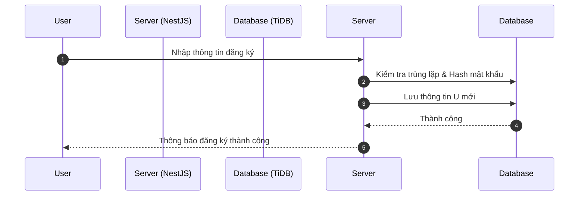

### Diagram UI-002: Đăng nhập hệ thống
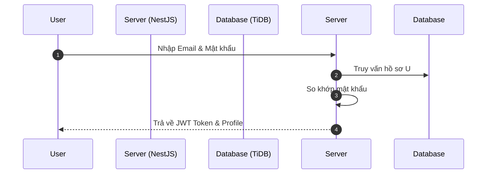

### Diagram UI-003: Xem hồ sơ cá nhân
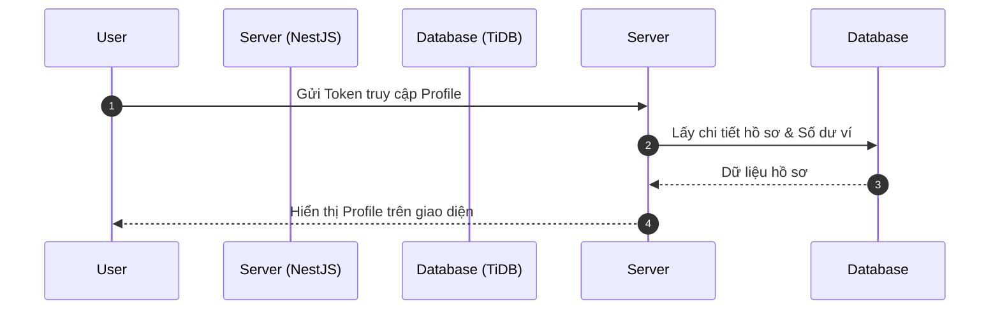

### Diagram UI-004: Cập nhật hồ sơ
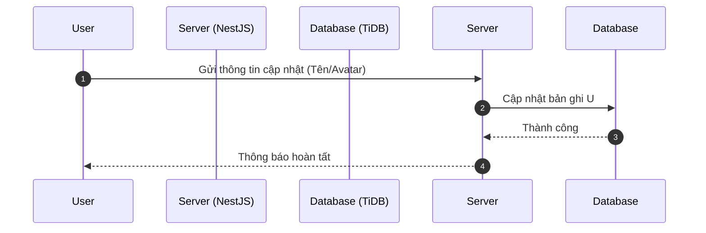

### Diagram UI-005: Đổi mật khẩu
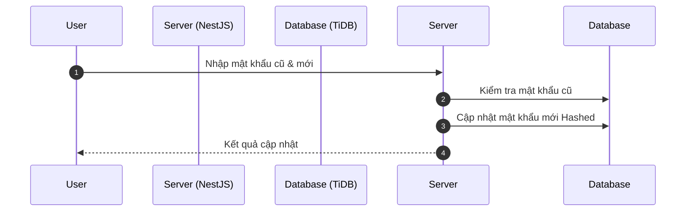

### Diagram UI-006: Cài đặt thông báo
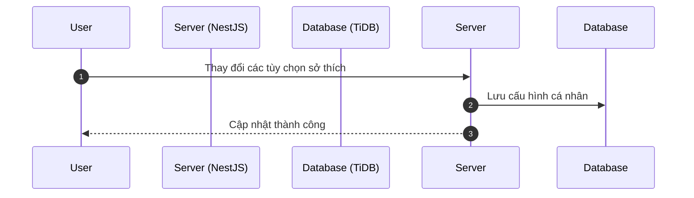

### Diagram UI-007: Nộp KYC
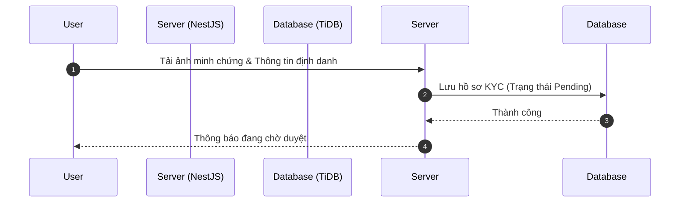

### Diagram UI-008: Nạp tiền (VNPAY)
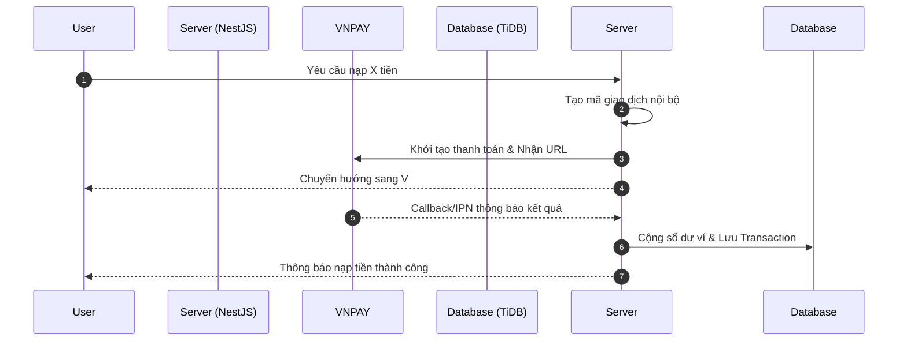

### Diagram UI-009: Rút tiền
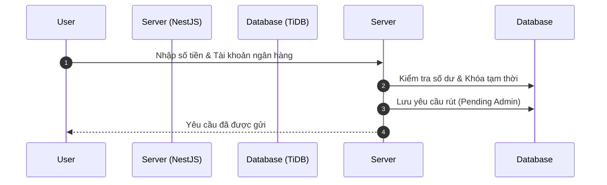

### Diagram UI-010: Xem lịch sử giao dịch
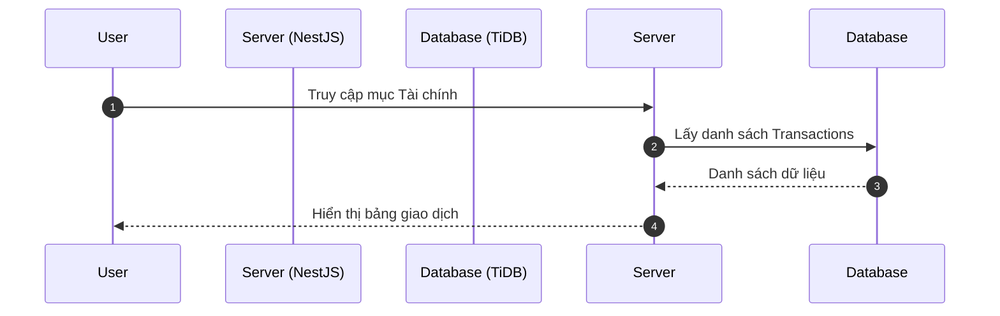

### Diagram UI-011: Quản lý thông báo
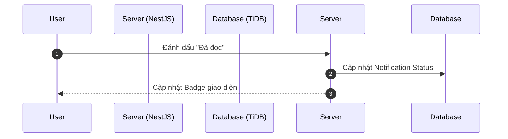

### Diagram UI-012: AI Chatbox
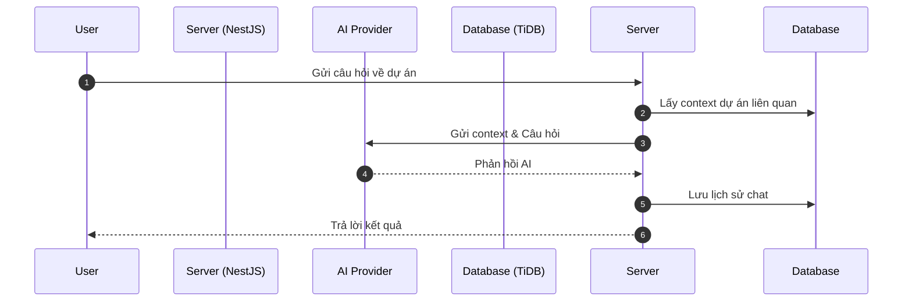

### Diagram UI-013: Thư viện Media
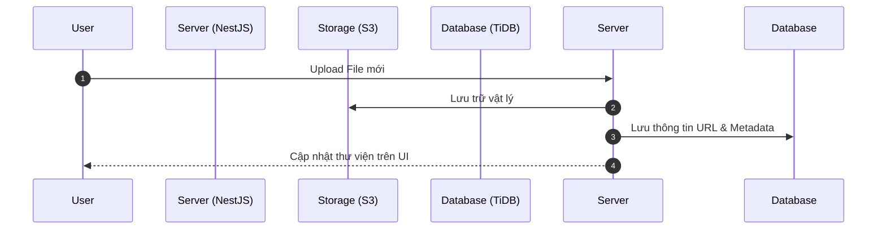

### Diagram UI-014: Tìm kiếm dự án
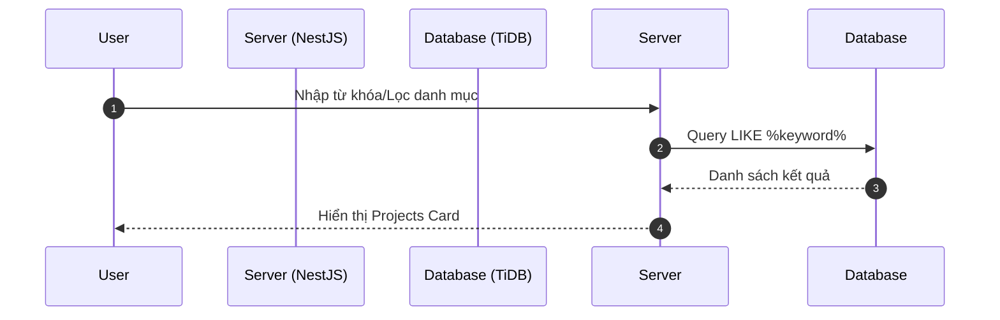

### Diagram UI-015: Xem chi tiết dự án
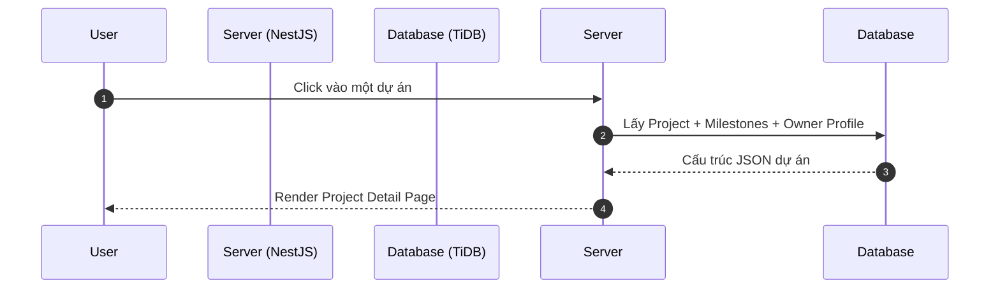

### Diagram UI-016: Đầu tư dự án (Sequence)
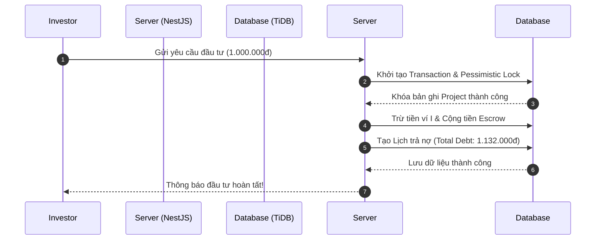

### Diagram UI-017: Theo dõi Portfolio
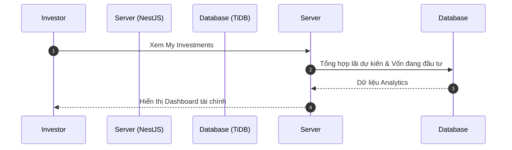

### Diagram UI-018: Tạo khiếu nại
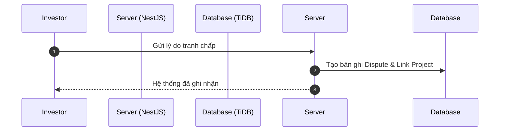

### Diagram UI-019: Voting Milestone
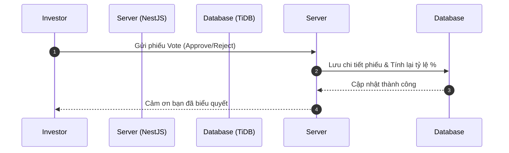

### Diagram UI-020: Tạo dự án mới
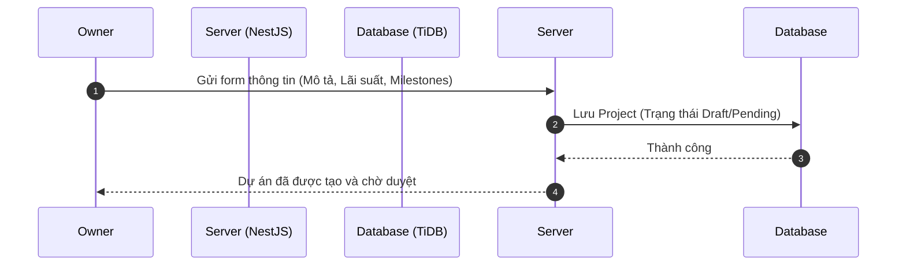

### Diagram UI-021: Cập nhật dự án
```mermaid
sequenceDiagram
    autonumber
    participant O as Owner
    participant S as Server (NestJS)
    participant D as Database (TiDB)

    O->>Server: Chỉnh sửa nội dung dự án
    Server->>Database: Update Project metadata
    Server-->>O: Thông tin đã được cập nhật
```

### Diagram UI-022: Quản lý Milestones
```mermaid
sequenceDiagram
    autonumber
    participant O as Owner
    participant S as Server (NestJS)
    participant D as Database (TiDB)

    O->>Server: Upload Bằng chứng Milestone
    Server->>Database: Cập nhật Proof & Chuyển sang Voting
    Server-->>O: Milestone đã chuyển trạng thái
```

### Diagram UI-023: Dừng huy động sớm
```mermaid
sequenceDiagram
    autonumber
    participant O as Owner
    participant S as Server (NestJS)
    participant D as Database (TiDB)

    O->>Server: Yêu cầu kết thúc đợt gọi vốn
    Server->>Database: Đóng trạng thái Funding & Tính số vốn thực tế
    Server-->>O: Huy động hoàn tất sớm
```

### Diagram UI-024: Danh sách dự án của tôi
```mermaid
sequenceDiagram
    autonumber
    participant O as Owner
    participant S as Server (NestJS)
    participant D as Database (TiDB)

    O->>Server: Truy cập My Projects
    Server->>Database: Lấy Projects theo OID
    Server-->>O: Hiển thị danh sách dự án
```

### Diagram UI-025: repay (Thanh toán)
```mermaid
sequenceDiagram
    autonumber
    participant O as Owner
    participant S as Server (NestJS)
    participant D as Database (TiDB)

    O->>Server: Chọn thanh toán kỳ hạn (Repay)
    Server->>Database: Khởi tạo Transaction & Trừ ví O
    Server->>Database: Phân bổ tiền về ví Investors theo lịch trả nợ
    Database-->>Server: Hoàn tất cập nhật nợ
    Server-->>O: Thanh toán kỳ hạn thành công
```
